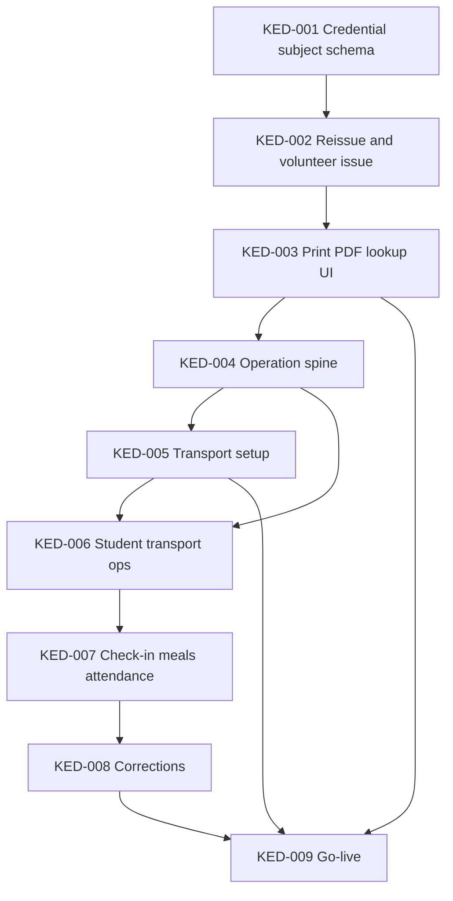

# Kalakriti Event-Day Phase 2 Task Breakdown

## Release outcome

Phase 2 is complete when an administrator can print and reissue Student and volunteer Credentials, staff can record online event-day operations (Student transport checkpoints, volunteer check-in, meals, Competition attendance), Leads can correct those operations with a reason, and a registration-locked Edition can go `live` after readiness checks pass.

This breakdown implements Phase 2 from [the architecture plan](./kalakriti-native-module-design.md), with the locked product decisions below. Task IDs (KED-*) are dependency identifiers for stacked PRs; they are not external tracker issue numbers.

## Locked decisions

- **Offline UI is out.** Land immutable `kalakriti_operation` rows and idempotent replay. No pending/synced/rejected client queue and no background replay UI. Stations are online-only.
- **People.** Credentials and check-in cover **Students and Edition volunteers**. Judges, Guests, and `kalakriti_person` stay Phase 3. Guardians get no event-day cards.
- **QR tokens are never stored plaintext.** Registration still inserts hash-only rows. Print always issues or reissues: revoke the prior active row, render a QR from the new token, discard the token. The same QR cannot be reprinted. UI must say previous cards stop working.
- **PDF is an on-demand stream** from a session-authed route (registration-export analog), not a persisted branded R2 object. Branding is code-defined via Edition `brandingKey`. Printing does not freeze branding.
- **Commands.** Zero mutators plus `kalakritiAuditEntry` for writes. `createServerFn` / API routes only for print/lookup download. Jobs via `ctx.asyncTasks` then `enqueue()`.
- **Auth.** No new global permissions. Operational authority stays Edition Assignment. `kalakriti.admin` and Edition Administrator retain override. Update the Registration Release surface allowlist and authorization E2E **in the PR that adds the route or mutator**. Event day may appear; Results, Awards, and Inventory stay 404.
- **Delete guards.** Each write surface that creates operations must block Student and Entry deletion before that surface ships.
- **Forward event-day writes require `live`.** Print, lookup, transport *setup*, and volunteer/Student credential issue are allowed from `draft` through `registration_locked` (and `live`). Corrections also require `live`.

## Scope guardrails

The release includes:

- generalized Credentials (Student or volunteer membership), reissue, manual yearly-ID lookup, print-ready PDF+QR;
- immutable operations with client-generated `operationId` uniqueness;
- Center buses/drivers, ordered vehicle status, and bus/driver change notifications;
- Student pickup, venue departure, and drop-off;
- volunteer check-in, breakfast, lunch, and per-Student Competition attendance;
- online-only corrections with reasons;
- go-live readiness and `registration_locked` → `live`.

The release excludes:

- offline operation queues and service-worker replay;
- Judges, Guests, `kalakriti_person`, scoresheets, Results, prizes, inventory, archive;
- CSV import, a branding editor, storing plaintext QR tokens;
- operational member roles other than `food_member`, `hospitality_member`, and `transport_coordinator`.

## Stacked PRs

| PR | Branch | Base | Tasks |
| --- | --- | --- | --- |
| 1 | `feat/kalakriti-p2-01-credentials` | `master` | KED-001, KED-002, KED-003 |
| 2 | `feat/kalakriti-p2-02-operations` | PR1 | KED-004 |
| 3 | `feat/kalakriti-p2-03-transport` | PR2 | KED-005 |
| 4 | `feat/kalakriti-p2-04-student-ops` | PR3 | KED-006 |
| 5 | `feat/kalakriti-p2-05-stations` | PR4 | KED-007 |
| 6 | `feat/kalakriti-p2-06-golive` | PR5 | KED-008, KED-009 |

## Dependency map



## Task conventions

Every implementation task must:

- use UUIDv7 IDs generated by the application (client for Zero mutators; server for print);
- enforce Edition scope in authoritative commands and queries, not only in UI filters;
- add or update idempotent seed data for every new table;
- add focused tests through the domain command or public query/API interface;
- regenerate Drizzle migrations and Zero schema from source rather than editing generated files;
- never put QR tokens, contact details, free text beyond allowlisted reasons, or file data in `audit_log` or `kalakriti_audit_entry` metadata;
- keep static imports in `createServerFn` and `routes/api/`;
- import design-system components through `@pi-dash/design-system/components/ui/...` or `/reui/...`;
- use `handleMutationResult()` for Zero mutation server results;
- wrap mutator side-effect enqueues with `ctx.asyncTasks` (never call notification handlers from mutators);
- update this plan when implementation evidence changes a dependency or invariant.

Protected files (generate only): `routeTree.gen.ts`, `packages/zero/src/schema.ts`, `packages/db/src/migrations/**`, design-system generated components.

TDD: one failing test through a public seam, then the minimum implementation. Seams are mutators, print/lookup HTTP handlers, and Playwright pages — not private helpers.

## KED-001: Generalize Credential subjects

**Outcome:** A Credential belongs to exactly one Student **or** one volunteer Edition Membership. Volunteer yearly IDs are allocated independently of Student IDs.

**Depends on:** None.

**PR:** 1

**Scope:**

- Add `nextVolunteerSequence` on `kalakriti_edition` (default 1, check `> 0`), same pattern as `nextStudentSequence`.
- Add nullable unique `humanId` on `kalakriti_edition_membership`. Guardians stay null. Volunteers receive `KALV-{year}-{NNNN}` via `formatKalakritiVolunteerHumanId` in `@pi-dash/shared`.
- Change `kalakriti_credential.studentId` to nullable. Add nullable `membershipId`.
- CHECK exactly one subject: `(studentId IS NOT NULL AND membershipId IS NULL) OR (studentId IS NULL AND membershipId IS NOT NULL)`.
- Replace the active-student unique index with two partial uniques: one active Credential per `studentId` where `studentId IS NOT NULL AND revokedAt IS NULL`; one active Credential per `membershipId` where `membershipId IS NOT NULL AND revokedAt IS NULL`.
- Keep unique `tokenHash` and the 64-hex check. Keep composite Edition FKs: `(editionId, studentId)` → student, `(editionId, membershipId)` → membership.
- Do not use `scopeType/scopeId`.
- Update Zero schema via `bun run zero:generate`. Inspect the Drizzle migration; do not hand-edit it.
- Existing Student Credential rows remain valid. Existing volunteer memberships may have null `humanId` until first issue (KED-002).

**Acceptance:**

- Inserting a Credential with both or neither subject fails at the database boundary.
- Two active Credentials for the same Student or the same membership fail at the database boundary.
- Volunteer human IDs do not collide with Student `KAL-{year}-{NNNN}` IDs.
- Student registration still inserts a Student-scoped Credential.

**Verify:**

```bash
bun run db:generate
bun run zero:generate
bun run check:types
bun run test:unit
```

## KED-002: Reissue and volunteer Credential issue

**Outcome:** Reissue revokes the prior active QR and copies the existing yearly ID. New volunteer enrollment allocates a yearly ID and a hash-only Credential.

**Depends on:** KED-001.

**PR:** 1

**Scope:**

- Add `kalakritiCredential.reissue` Zero mutator. Args include `credentialId`, `editionId`, subject (`studentId` or `membershipId`), `tokenHash`, `auditEntryId`, `now`. Client generates 32 random bytes and SHA-256 hex (same helper as Student create). Mutator: lock Edition, authorize, revoke the current active row (`revokedAt`/`revokedBy`), insert the new row with the **same** `humanId`, write `kalakritiAuditEntry` domain `credential` action `reissued`. Metadata: `{ subjectKind, humanId }` only.
- If the subject has no active Credential, reissue **issues** the first row (still copies membership/student `humanId`; allocate volunteer `humanId` if null).
- Extend `ensureUnassignedVolunteerEnrollment` so first-time volunteer membership insert (and archived → active reactivation without an active Credential) inserts a volunteer Credential. Callers (`addVolunteers`, linked-event register, approved interest) must pass `credentialId` + `credentialTokenHash` generated by the caller (client form or server function). Allocate `humanId` from `nextVolunteerSequence` under the Edition row lock.
- Student create path stays hash-only; do not change the discarded-token behavior.
- Query: do not expose `tokenHash` to clients that are not already receiving the full Credential row for admin print lists. Prefer a dedicated credentials query that selects allowlisted columns (`id`, `editionId`, `humanId`, `studentId`, `membershipId`, `issuedAt`, `revokedAt`) — **never** `tokenHash` in UI tables.
- Authorize reissue: global `kalakriti.admin` or Edition Administrator. Volunteer Coordinators do not print or reissue.
- Add audit domain `credential` to `KALAKRITI_AUDIT_DOMAINS`.

**Acceptance:**

- Reissue leaves exactly one active Credential per subject. The previous `tokenHash` no longer matches an active row.
- `humanId` is unchanged across reissue (KRR-011).
- Adding a volunteer creates membership + active Credential + `KALV-` ID.
- Reactivating an archived volunteer keeps the same `humanId` and issues a new Credential if none is active.
- Guardians never receive Credentials.
- Unauthorized actors are rejected.

**Verify:**

```bash
bun run check:types
bun run test:unit
```

Cover mutators at `packages/zero/src/mutators/__tests__/`.

## KED-003: Print, lookup, and Credentials page

**Outcome:** Edition and global administrators can look up a yearly ID and download a print-ready card. Print issues or reissues server-side and streams a PDF. The QR payload is an opaque token, not a person ID.

**Depends on:** KED-002.

**PR:** 1

**Scope:**

- Code-defined branding map keyed by `brandingKey` with one default branding (colors + wordmark using existing `@pi-dash/pdf` assets where possible). Unknown keys fall back to default. No admin branding editor.
- Add `qrcode` (or equivalent) inside `@pi-dash/pdf` to rasterize a QR PNG. Embed it in a React-PDF card: yearly ID, name, subject kind, primary assignment label (`isPrimary`) or Center name for Students, Edition name/year. QR encodes the **opaque token string only**.
- Session-authed `POST /api/kalakriti/$year/credentials/print` (static imports). Auth: `requireSession` + Edition admin or `kalakriti.admin`. Body: `{ subjectIds: { studentId?: string, membershipId?: string }[] }` (max a documented bound, e.g. 100). For each subject: generate token, hash, reissue/issue in one DB transaction, render card, discard token. Return `application/pdf` with `Cache-Control: private, no-store`. Single-subject one page; multi-subject concatenated PDF. Confirm copy in UI: printing invalidates previous cards.
- Session-authed lookup: `GET /api/kalakriti/$year/credentials/lookup?humanId=` or a `createServerFn`. Returns name, kind (`student` \| `volunteer`), Center or primary role label, `humanId`, active credential issue time. **Never** the token or `tokenHash`. Same admin authorization. 404 for unknown IDs in this Edition (do not leak other Editions).
- Page `/kalakriti/$year/credentials`: `beforeLoad` 404 unless Edition admin or global admin. `DataTableWrapper` of Students and volunteers with active/revoked status, lookup field, print/reissue actions. Storage key `kalakriti_credentials_table_state_v1`.
- Nav: Credentials item for those admins only. Place with other admin surfaces (after Volunteers or before Audit).
- Add `@pi-dash/pdf` to `apps/web` **only if** the print route imports it with a static server-only import from `routes/api/`. Do not import PDF/QR libraries from client components.
- Update `kalakriti-registration-release-surface.test.ts` route allowlists (`credentials.tsx`, `credentials/print.ts`, `credentials/lookup.ts` as applicable). Do not add Event day, Results, Awards, or Inventory.
- E2E: `packages/e2e/tests/kalakriti/credential-print.spec.ts` — admin prints (PDF content-type), reissue changes `tokenHash` and preserves `humanId`, lookup by yearly ID, Guardian/Liaison direct URL 404. Super-admin project gating like other Kalakriti specs.
- Print allowed in `draft`, `registration_open`, `registration_locked`, and `live`. Denied for `archived`.

**Acceptance:**

- Print response is a PDF; QR is not a Student/membership UUID.
- After print, the previous active `tokenHash` is revoked.
- Lookup never includes token material.
- Non-admin Edition members cannot open the page or the API.
- Results/Awards/Inventory routes remain 404.

**Verify:**

```bash
bun run check:types
bun run test:unit
bun run check
bun run check:unused
cd packages/e2e && bash run-e2e.sh tests/kalakriti/credential-print.spec.ts
```

## KED-004: Immutable operation spine

**Outcome:** Event-day operations are append-only rows keyed by client `operationId`. Duplicate inserts return the existing row and never toggle. There is no station UI.

**Depends on:** KED-003.

**PR:** 2

**Scope:**

- Table `kalakriti_operation`: `id`, `editionId`, `operationId` (UUIDv7, unique), `type` enum (`pickup`, `venue_departure`, `drop_off`, `volunteer_check_in`, `breakfast`, `lunch`, `competition_attendance`), nullable `studentId` / `membershipId` (exactly one), nullable `competitionSessionId`, `occurredAt`, `recordedBy`, `createdAt`, nullable `supersededByOperationId`, nullable `correctionReason`.
- Unique `operationId`. Composite Edition FKs. Seed empty/idempotent rows only as required by `scripts/seed.ts` conventions.
- Pure module `packages/zero/src/kalakriti-operation-rules.ts`: replay (`same operationId` → existing), derived current state, eligibility helpers. Types not yet enabled for live staff still have rule functions; mutators may accept them in tests but **forward recording in production requires `live`** (enforced in KED-009; until then, allow recording in tests against any non-archived Edition **or** fail with a stable `edition_not_live` if easier — prefer **not** requiring `live` until KED-009 so PR4/PR5 can test ops before go-live exists). Locked choice: **operations may be recorded in unit tests without `live` until KED-009**; KED-009 then requires `live` for forward ops and updates tests.
- Mutators `kalakritiOperation.record` and `kalakritiOperation.recordManual`. `record` resolves SHA-256(`credentialToken`) to an **active** Credential. `recordManual` resolves `humanId` within the Edition. Duplicate `operationId` is a successful no-op returning the original type/subject (do not change type on replay).
- Student `delete` and Entry `remove` must fail if any operation references that Student (or any member of the Entry).
- No `/event-day` route. Update mutator allowlist in the surface test.
- Audit domain `event_day_operation`, action `recorded`. Metadata: `{ type, operationId, subjectKind }` — no token, no human-readable free text beyond type.

**Acceptance:**

- Replaying the same `operationId` does not create a second row and does not reverse state.
- A revoked QR cannot record an operation.
- Cross-Edition humanId/token is rejected.
- Student delete is blocked once an operation exists.

**Verify:**

```bash
bun run db:generate
bun run zero:generate
bun run check:types
bun run test:unit
```

## KED-005: Center transport setup

**Outcome:** Each Center can have buses and drivers. Status moves only forward. Bus or driver field changes notify that Center's Guardians and Liaisons.

**Depends on:** KED-004.

**PR:** 3

**Scope:**

- Tables: `kalakriti_transport_assignment` (Center, vehicle/driver/phone/capacity/notes, `status`), `kalakriti_transport_status_history` (immutable transitions).
- Status machine: `planned` → `arrived_at_center` → `arrived_at_venue` → `departed_venue` → `completed`. Ordinary staff cannot skip backwards.
- Add `transport_coordinator` to `KALAKRITI_EDITION_RESPONSIBILITIES` (Center-scoped). Update assignment CHECK, labels, Assign role groups, `getKalakritiResponsibilityScopeKind`. Do not rename existing IDs.
- Mutators: create/update assignment (bus/driver/phone/capacity/notes), `transitionTransportStatus`. Auth: `kalakriti.admin`, Edition Administrator, `transport_lead` (edition), `transport_coordinator` (that Center), Center-scoped Liaisons. **Guardians denied** (KRR-007).
- Center detail UI section for transport.
- Notification: new job `notify-kalakriti-transport-changed`, recipients = affected Center Guardians + Liaisons (copy schedule-change stack). Deterministic idempotency key; no `Date.now()`. Inbox + WhatsApp topic.
- Pure helper: every non-retired Center has ≥1 transport assignment (consumed by KED-009).
- Seeds for new tables.

**Acceptance:**

- Guardian cannot create or transition transport.
- Illegal backward status is rejected.
- Changing driver/bus enqueues one notification keyed stably per change.

**Verify:**

```bash
bun run db:generate
bun run zero:generate
bun run check:types
bun run test:unit
cd packages/e2e && bash run-e2e.sh tests/kalakriti/center-transport.spec.ts
```

## KED-006: Student transport operations

**Outcome:** Staff record pickup, venue departure, and drop-off with a live QR token or yearly ID. A Student without an effective pickup is derived absent.

**Depends on:** KED-004, KED-005.

**PR:** 4

**Scope:**

- Enable `pickup`, `venue_departure`, `drop_off` in the recording mutators with order rules (pickup before departure before drop-off; drop-off requires pickup).
- Auth: Transport Lead, Transport Coordinator (Student's Center), Center-scoped Liaisons, Edition admin, `kalakriti.admin`. Guardians denied.
- Route `/kalakriti/$year/event-day` with a transport station: camera QR (library allowed on this client page) + manual yearly ID field. QR payload = opaque token; hash and call `record`. Duplicate scan is success with already-recorded state.
- Nav: Event day for actors who can record transport (not Guardians).
- Derived absence: no effective (non-superseded) pickup ⇒ Student cannot later receive meals/attendance (enforced in KED-007; expose the helper now).
- Update surface tests and `registration-release-authorization.spec.ts`: Event day exists; Results/Awards/Inventory still 404.
- E2E: pickup via manual ID, duplicate no-op, Guardian 404 on event-day.

**Acceptance:**

- Pickup then duplicate pickup keeps one effective pickup.
- Venue departure without pickup is rejected.
- Guardian cannot record transport.

**Verify:**

```bash
bun run check:types
bun run test:unit
cd packages/e2e && bash run-e2e.sh tests/kalakriti/event-day-transport.spec.ts
```

## KED-007: Check-in, meals, and attendance

**Outcome:** Volunteers check in. Meals and Competition attendance require derived eligibility.

**Depends on:** KED-006.

**PR:** 5

**Scope:**

- Make `food_member` and `hospitality_member` assignable in mutator allowlists and Volunteers Assign role groups (edition-scoped members).
- `volunteer_check_in`: Hospitality Lead/member, Edition admin, `kalakriti.admin`.
- `breakfast` / `lunch`: Food Lead/member, Edition admin, `kalakriti.admin`. Student requires effective pickup. Volunteer requires effective check-in.
- `competition_attendance`: Competition Volunteer or Coordinator for that Competition's scope, Edition admin, `kalakriti.admin`. Requires Student pickup. `competitionSessionId` required. Record per Student (entry member), not per group Entry.
- Event day page gains station modes. Failed eligibility is a rejected mutator with a stable error string, not a queued UI state.
- Keep delete guards.

**Acceptance:**

- Not-picked-up Student cannot receive breakfast or attendance.
- Volunteer cannot receive lunch without check-in.
- Out-of-scope Competition Volunteer is rejected.

**Verify:**

```bash
bun run check:types
bun run test:unit
cd packages/e2e && bash run-e2e.sh tests/kalakriti/event-day-stations.spec.ts
```

## KED-008: Online corrections

**Outcome:** Leads and administrators can supersede an operation with a mandatory reason. Ordinary members cannot. Eligibility re-derives from the remaining effective operations.

**Depends on:** KED-007.

**PR:** 6

**Scope:**

- Mutator `kalakritiOperation.correct` with `targetOperationId`, new `operationId`, `reason` (non-empty, bounded length), `auditEntryId`, `now`. Inserts a correction operation and sets `supersededByOperationId` on the target. Never deletes history.
- Auth: domain Lead/Coordinator or Edition admin / `kalakriti.admin`. Food member, hospitality member, competition volunteer, and liaison volunteer **cannot** correct.
- Forward ops and corrections require `live` once KED-009 lands; implement the `live` gate in KED-009 if this task merges in the same PR (same PR 6).
- Audit action `corrected`. Metadata: `{ type, targetOperationId }` plus reason **omitted** if the central audit policy forbids free text — store reason only on `kalakriti_operation.correctionReason` / Kalakriti audit `reason` column (Kalakriti audit already has `reason`). Do not copy reason into central `audit_log` metadata.

**Acceptance:**

- Correcting pickup restores meal eligibility when a new pickup is recorded after correction (or when pickup is superseded and a replacement pickup is recorded — document the exact restore path: superseding pickup without replacement means absent again).
- Members cannot correct.

**Verify:** unit tests on the mutator; E2E in KED-009 journey.

## KED-009: Go-live

**Outcome:** A registration-locked Edition can transition to `live` when readiness passes. One Edition is live. Center registration controls close in the same transaction.

**Depends on:** KED-003, KED-005, KED-008.

**PR:** 6

**Scope:**

- Extend `kalakritiEditionTransitionSchema` with `live`. Allowed edge: `registration_locked` → `live` only. Keep existing open/lock/reopen edges.
- Go-live blockers:
  - Edition lifecycle is `registration_locked`;
  - every Center has both registration controls disabled;
  - active sessions pass the existing registration session validity checks;
  - assignments exist for Overall Events Lead, Transport Lead, and Food Lead;
  - every non-retired Center has ≥1 transport assignment;
  - every active Student and every active volunteer membership has an active Credential.
- Same transaction: set both Center controls false (already false if locked, still write-confirm).
- Unique live Edition already indexed.
- UI on `edition-lifecycle-card.tsx`.
- After this task: `record` / `recordManual` / `correct` require `lifecycle === "live"`. Print/lookup/transport assignment setup remain allowed in `registration_locked`.
- Docs: update `docs/architecture/kalakriti-registration.md`, add `docs/architecture/kalakriti-event-day.md`, index row, `README.md`, `project-structure.md`, `.ruler/agent-guide.md` then `bun run ruler:apply`. Evidence matrix `docs/kalakriti-event-day-phase2-evidence.md`.
- E2E: blockers prevent go-live; successful live transition; correction restores eligibility; Guardian denied transport; Results/Awards/Inventory still 404.

**Acceptance:**

- Two concurrent go-live attempts cannot yield two live Editions.
- Event-day forward writes fail in `registration_locked` and succeed in `live`.
- Print still works in `registration_locked`.

**Verify:**

```bash
bun run check:types
bun run test:unit
bun run check
bun run check:unused
cd packages/e2e && bash run-e2e.sh tests/kalakriti/lifecycle-golive.spec.ts
```

## Deep command interface

Callers use these commands. Eligibility, QR hashing, transport order, meal gates, duplicate replay, and derived absence stay inside them.

```ts
reissueCredential({ credentialId, subject, tokenHash, auditEntryId, now })
lookupCredential({ editionId, humanId })
printCredentials({ editionId, subjects })

recordOperation({ operationId, credentialToken, type, occurredAt, sessionId? })
recordManualOperation({ operationId, humanId, type, occurredAt, sessionId? })
correctOperation({ operationId, targetOperationId, reason })

upsertTransportAssignment(...)
transitionTransportStatus({ assignmentId, to, occurredAt })

transitionEdition(..., targetLifecycle: "live")
```
