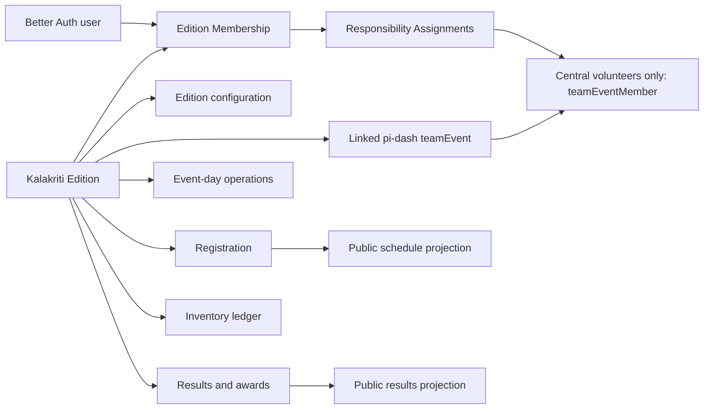
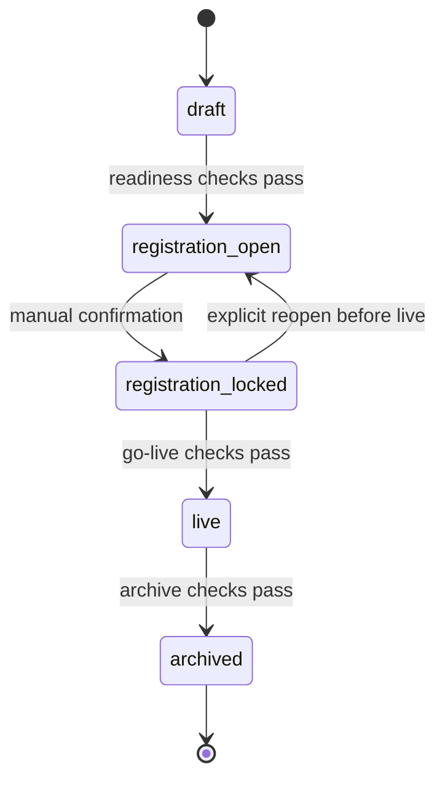

# Kalakriti Native Module Architecture and Delivery Plan

## Decision

Rebuild Kalakriti as a native, edition-bound section of pi-dash at `/kalakriti/:year`. The module will reuse pi-dash identity, central volunteers, events, notifications, uploads, reimbursements, and vendor payments, while keeping Kalakriti's yearly people, configuration, registration, operations, and results in its own data boundary.

The first production milestone is a Registration Release. It must let administrators configure an Edition, invite and assign yearly users, open student registration per Center, register individual and group Competition Entries, and publish the live schedule. Event-day operations and results will follow without requiring the registration model to be replaced.

No old-app migration is required, and the existing Kalakriti codebase will not be modified.

## Goals

- Preserve the current Kalakriti capabilities that remain useful and improve the weak ownership, access, validation, audit, and offline boundaries found in the existing application.
- Keep the existing pi-dash structure recognizable by introducing one bounded module instead of spreading Kalakriti-specific columns and branches through unrelated domains.
- Make every yearly record, permission, and dashboard query explicitly Edition-scoped.
- Reuse central pi-dash users for volunteers and administrators while giving Guardians yearly access without treating them as normal volunteers.
- Deliver registration early without designing a temporary schema or temporary authorization model.
- Encode business invariants behind domain commands so UI routes do not become the source of truth.

## Non-goals

- Migrating data from the old Kalakriti application.
- Editing or retiring the old application.
- Creating a second authentication system.
- Giving Students, Judges, or Guests login access.
- Building structured digital judging or judge score entry.
- Replacing pi-dash reimbursement or vendor-payment workflows.
- Importing registrations from CSV.
- Carrying people, assignments, inventory, or operations into a new Edition.

## Architecture at a glance



The Edition is the aggregate boundary. A linked `teamEvent` makes Kalakriti participate in existing pi-dash event, reimbursement, and vendor-payment flows, but it does not own Kalakriti registration or authorization.

## Ownership rules

1. Every Kalakriti business row belongs to one Edition, either with a direct `editionId` or through a parent whose Edition cannot change.
2. A normal pi-dash `user` owns login identity only. Yearly profile snapshots, Center access, responsibilities, and operational visibility belong to Edition Memberships and Assignments.
3. A normal pi-dash `teamEvent` represents Kalakriti to the wider dashboard. Edition creation selects its owning pi-dash Team because `teamEvent.teamId` is required. The Edition is authoritative for its name and event date, and core linked-event edits and deletion are disabled outside the module.
4. A central volunteer appears in `teamEventMember` only after explicit Edition assignment. Guardian, Student, Judge, and Guest records never become linked event members.
5. Public schedule and result views are privacy-filtered projections. They are not direct access to operational tables.

## Identity and yearly access

### Central volunteers and administrators

Central volunteers keep their existing Better Auth `user` records. Assigning a volunteer to an Edition creates an Edition Membership and at least one Responsibility Assignment, then atomically ensures a matching `teamEventMember`. Removing the final assignment archives the Edition Membership and removes the linked event member unless another explicit Edition relationship still requires it. Linked-event self-join, interest approval, direct member management, and direct attendance editing are disabled so explicit Edition assignment and Kalakriti check-in remain authoritative.

Global pi-dash administrators have full override access to every Edition without a copied yearly admin row. Edition administrators are central users assigned through the module, and multiple Edition administrators are allowed.

### External Guardians

Guardians are invitation-only. Creating one uses Better Auth for credentials and creates a `kalakritiExternalIdentity` marker plus an Edition Membership containing the yearly name, email, phone, and Center assignments. The marker excludes that account from normal user lists and volunteer pickers.

Marked external identities use a minimal technical `external_user` global role with no central volunteer permissions. This role is an authentication classification, not a Kalakriti responsibility. The dedicated Guardian invitation and sign-in paths must skip volunteer onboarding, orientation WhatsApp groups, and normal volunteer landing pages; a signed-in Guardian lands on the accessible Edition instead.

When an exact verified email already exists:

- If it belongs to a marked external identity with no active Edition Membership, an administrator confirms reuse. The account is reactivated, keeps its credentials, receives an access notification, and gains a new yearly profile snapshot.
- If it belongs to a central user, the same identity may be assigned without converting it to an external-only account or hiding it from central user management.
- Similar names or phone numbers never trigger automatic identity merging.

When the last active membership of a marked external identity is archived, pi-dash revokes its sessions and prevents sign-in. This must use Better Auth's ban or a dedicated pre-session access guard because current pi-dash authentication automatically restores `user.isActive` after a successful sign-in. Reassignment clears the access block. A central user is never globally disabled because an Edition Membership ended.

External identity records survive Edition deletion so the same verified account can be safely reused in a later year.

### Non-login people

Students, Judges, and Guests are Edition-owned records with no Better Auth identity. The Overall Events Lead manages Judge assignment, and Hospitality Leads manage Guests. They receive Credentials only when event-day identification requires one.

## Lifecycle



Only one Edition may be `live` at a time. Future Editions may be in `draft`, `registration_open`, or `registration_locked` concurrently.

| State | Allowed behavior |
| --- | --- |
| `draft` | Configure the Edition, assign users, invite Guardians, and prepare registration. Assigned Guardians may sign in, but registration commands remain disabled. |
| `registration_open` | Centers with the relevant local control enabled may create and edit Students and Competition Entries. Configuration and assignments remain editable subject to dependency rules. |
| `registration_locked` | Student and Competition Entry registration is closed. Volunteer assignments, schedule work, transport setup, inventory setup, and administrative preparation continue. Structural competition rules become immutable. |
| `live` | Event-day commands are enabled. Registration is forced closed for every Center, and structural edits remain blocked. |
| `archived` | Operational data becomes permanently read-only and visible only to administrators. Public historical schedules and results remain available. |

Lifecycle transitions are manual and require confirmation. `registration_locked` may return to `registration_open`; transitions from `live` are one-way.

### Readiness checks

Opening registration requires:

- an event date and planned registration close time;
- an age cutoff date, defaulting to the event date;
- at least one non-overlapping Age Category;
- at least one Center;
- Competition rules, session capacities, and age-specific registration limits;
- valid Competition Sessions and Venues for anything exposed for registration.

Going live requires:

- registration locked globally and for every Center;
- every active Competition Session scheduled without Student or Venue conflicts;
- required Leads and Coordinators assigned;
- Center transport details recorded;
- Credentials generated for all eligible people.

Archiving requires:

- every Competition Session completed or cancelled;
- Results and prize distribution resolved;
- transport workflows completed;
- inventory reconciled.

Only global pi-dash administrators can permanently delete an Edition, using strong confirmation. Deletion removes Edition-owned data but preserves reusable external identities.

## Registration controls

Each Center has two independent controls:

- Student registration and editing enabled.
- Competition Entry registration enabled.

The effective permission for a registration command is the intersection of the Edition lifecycle, the relevant Center control, the actor's assignment, and the record's dependency state. A bulk lock action disables both controls for all Centers. Administrators cannot silently bypass a closed control; they must explicitly reopen the relevant Center, which is audited.

Entering `live` disables both controls for all Centers in the same transaction as the lifecycle transition.

## Registration model and invariants

### Students and Age Categories

A Student stores only Edition, Center, name, date of birth, `male` or `female`, derived Age Category, operational state, and generated human-readable ID. Medical and emergency fields remain outside the current scope.

Age Category is calculated using the Edition's age cutoff date. Administrators may override the category with a mandatory reason and audit entry. Age ranges may intentionally contain gaps, but they cannot overlap.

Per Center and Age Category, administrators configure maximum male and female Students. The Registration command enforces the matching quota before inserting or changing a Student.

Potential duplicates are detected using Center, normalized name, and date of birth. They produce a warning that requires administrator confirmation, not a database uniqueness failure.

Changing date of birth or gender is blocked when it would invalidate an existing Competition Entry. The system never silently removes entries. Deleting a Student hard-deletes the Student and entries only before any transport, meal, attendance, Result, or prize activity exists; after that point deletion is blocked.

### Competitions and sessions

A Competition defines its Competition Category, participation mode, gender eligibility, and group-size rules. A Competition Session combines that definition with one Age Category, time range, Venue, and capacity.

Capacity counts Competition Entries. An individual entry consumes one unit and a group entry also consumes one unit. There is no waitlist.

Each Age Category configures:

- the maximum total Competitions per Student;
- the maximum Competitions from one Competition Category per Student.

The Registration command also enforces gender eligibility, active configuration, group size, same-Center membership, session capacity, and the rule that one Student appears at most once in a Competition Session. Any overlapping Competition Sessions for the same Student are rejected with no administrator override.

Valid registrations are accepted immediately. There is no approval workflow.

Structural fields such as eligibility, capacity, Age Category, participation mode, and group rules become immutable after registration closes. A Competition with entries may be cancelled but not deleted; affected users are notified and history remains. Referenced Centers, Age Categories, Competition Categories, Competitions, Sessions, and Venues are protected from deletion and must be retired, cancelled, or detached where allowed.

### Group entries

All Entry Members must belong to the same Center. Minimum and maximum group sizes are enforced on every change. Attendance and prize distribution remain individual, while group eligibility requires the configured minimum number of present members. Winner and runner-up points are awarded once to the Center for the group.

## Scheduling and public views

The Edition is a one-day event in `Asia/Kolkata`. A Competition Session cannot overlap another session in the same Venue. Schedule changes after registration locks are allowed only when they introduce no Student conflict.

The public schedule is an attendee-facing projection that updates when Sessions are added or changed. It contains Competition, Age Category, time, Venue, and public status, but excludes staffing and private operational details.

Schedule changes immediately notify affected Guardians, Liaisons, Coordinators, and volunteers through in-app and WhatsApp channels. Public routes remain available for archived Editions.

## Responsibilities and authorization

Kalakriti uses pi-dash authentication and global permissions, then applies Edition Membership and Assignment checks inside every query and command. It does not introduce a parallel role engine.

Responsibilities are fixed in code and a user may hold several. One assignment is marked as the primary ID-card label.

| Responsibility | Scope | Authority |
| --- | --- | --- |
| Edition Administrator | Edition | Full Edition management; global administrators retain override. |
| Volunteer Coordinator | Edition | Assigns all central-volunteer responsibilities, including Leads, Coordinators, members, and Liaison Center scopes. Cannot appoint another Volunteer Coordinator or manage Guardians. |
| Overall Events Lead | Edition, exactly one | Manages Competition Categories, Competitions, schedule, and Judges. |
| Competition Category Lead | Competition Category, multiple | Oversees the category and any one Lead may approve and publish its Results. Cannot edit Competition configuration or schedule. |
| Competition Coordinator | Competition, multiple | Manages Scoresheet Sets, submission photos, draft Results, and corrections in scope. |
| Competition Volunteer | Competition, multiple | Records individual attendance. |
| Liaison | Center, one or more | Manages scoped Students and Competition Entries and may perform transport checkpoints. |
| Guardian | Center, one or more | Manages scoped Students and Competition Entries, but cannot perform transport checkpoints. |
| Food Lead or member | Operational team | Serves breakfast and lunch; Leads and administrators correct records. |
| Transport Lead or Coordinator | Operational team and Center | Leads oversee transport; Coordinators manage bus and driver details, vehicle status, and Student transport operations for assigned Centers. |
| Logistics Lead or member | Operational team | Leads manage item setup, opening balances, adjustments, and reversals; members record purchases, dispatches, and returns. |
| Awards Lead or member | Operational team | Records prize distribution; Leads and administrators correct it. |
| Venue Lead or member | Operational team | Leads manage the Venue catalog; the Overall Events Lead schedules Sessions. |
| Hospitality Lead or member | Operational team | Leads manage Guests; members check in non-Student people. |
| Media or Fundraising member | Operational team | Receives roster and Credential visibility but no additional module command in the current scope. |

Only Edition or global administrators appoint and remove Volunteer Coordinators. Volunteer Coordinators assign the Overall Events Lead, Competition Category Leads, Competition Coordinators, Competition Volunteers, operational Leads and members, and Liaisons. Administrators invite and assign Guardians.

Ordinary team members perform forward operations only. Relevant Leads, Coordinators, and administrators may correct their domain's records with a mandatory reason and audit entry.

### Query visibility

- Student data is limited to administrators and users assigned to the Student's Center or Competition scope.
- Volunteer contact details are limited to administrators, Volunteer Coordinators, relevant Leads, and people sharing a direct assignment.
- Category and Competition dashboards only expose their assigned scope.
- The Center leaderboard is private to authorized Edition users.
- The full audit log is administrator-only; Leads see audit entries for their own domain.
- Archived operational data is administrator-only even for former Edition members.

## Deep module interfaces

Routes and forms should call domain commands rather than performing table-shaped CRUD. The listed commands are illustrative names, not a requirement to expose one class or service object.

### Edition Administration

Owns lifecycle, linked-event synchronization, yearly access, structural cloning, and registration controls.

```ts
createEdition(input)
cloneEditionConfiguration(sourceEditionId, input)
transitionEdition(editionId, targetState, confirmation)
setCenterRegistrationControls(centerId, controls)
lockAllCenterRegistration(editionId)
assignResponsibility(membershipId, assignment)
removeResponsibility(assignmentId)
inviteGuardian(editionId, identity, centerIds)
archiveEditionMembership(membershipId)
```

This interface hides readiness calculations, the one-live-Edition rule, `teamEvent` creation, `teamEventMember` synchronization, external-account dormancy, and session revocation.

### Registration

Owns Students, quotas, Competition Entries, and all cross-record registration invariants.

```ts
registerStudent(input)
updateStudent(studentId, changes)
deleteStudent(studentId)
confirmPotentialDuplicate(studentId, candidateIds)
registerIndividualEntry(sessionId, studentId)
registerGroupEntry(sessionId, studentIds)
changeEntryMembers(entryId, studentIds)
removeEntry(entryId)
```

This interface hides lifecycle and Center controls, Age Category derivation, gender and capacity checks, count limits, group rules, and schedule-conflict detection.

### Event-day Operations

Owns idempotent forward actions and online-only corrections.

```ts
recordOperation({ operationId, credential, type, occurredAt })
recordManualOperation({ operationId, humanId, type, occurredAt })
correctOperation({ operationId, targetOperationId, reason })
```

This interface hides Credential resolution, transport state order, check-in and meal eligibility, attendance eligibility, duplicate replay, and derived current state.

### Competition Results

Owns evidence, draft Results, approval, publication, revisions, points, and awards.

```ts
createScoresheetSet(sessionId, orderedFiles)
deletePriorScoresheetSet(scoresheetSetId)
setSubmissionPhotos(entryId, orderedFiles)
saveDraftResult(sessionId, winnerEntryId, runnerUpEntryId)
publishResult(resultId)
unpublishResult(resultId, reason)
recordPrizeDistribution(entryMemberId, placement)
```

This interface hides attendance eligibility, evidence requirements, winner and runner-up exclusivity, Result versioning, public privacy projection, and group completion.

### Inventory Ledger

Owns immutable inventory balances and finance references.

```ts
createInventoryItem(input)
postMovement(input)
reverseMovement(movementId, reason)
reconcileInventory(editionId)
```

This interface hides signed balance arithmetic, required Competition links, reversal rules, and optional reimbursement or vendor-payment linkage.

### Read models

Edition dashboards, readiness checks, public schedule, public Results, Center capacity, and leaderboard queries should use edition-filtered projections and aggregate queries. They must not load the full Edition dataset into the browser and derive permissions or totals there.

## Data model

The table list is grouped by ownership rather than proposed migration order. All IDs use app-generated UUIDv7, all mutable tables include timestamps, and sensitive changes include actor IDs.

### Edition and access

| Table | Purpose and key constraints |
| --- | --- |
| `kalakriti_edition` | Unique `year` and unique `teamEventId`; lifecycle, event date, cutoff date, planned registration close, timezone, branding key, and winner/runner-up points. |
| `kalakriti_external_identity` | Persistent marker keyed by `userId`; distinguishes external-only Guardian identities from central users and drives picker exclusion and dormancy rules. |
| `kalakriti_edition_membership` | Unique `(editionId, userId)`; membership kind, yearly profile snapshot, active/archive state, and primary card label. |
| `kalakriti_assignment` | Fixed responsibility plus typed nullable scope FKs for Center, Competition Category, or Competition and an operational-team value. Check constraints require exactly the scope valid for the responsibility. |
| `kalakriti_person` | Edition-owned non-login Judge or Guest profile. |
| `kalakriti_judge_assignment` | Connects Judges to Competitions and records the assigning Overall Events Lead. |

Do not use a generic `scopeType/scopeId` pair without foreign keys. Nullable typed scope columns plus check constraints retain referential integrity while keeping one assignment interface.

### Registration configuration

| Table | Purpose and key constraints |
| --- | --- |
| `kalakriti_center` | Edition-owned Center with independent Student and Competition Entry registration controls. Unique normalized name within the Edition. |
| `kalakriti_age_category` | Edition-owned inclusive age range, sort order, and per-Student Competition limits. Exclusion or command checks prevent overlapping ranges. |
| `kalakriti_center_age_quota` | Unique `(centerId, ageCategoryId)` male and female Student limits. Both parents must belong to the same Edition. |
| `kalakriti_competition_category` | Edition-owned category, ordering, and retirement state. |
| `kalakriti_competition` | Competition definition, participation mode, gender eligibility, group rules, and cancellation state. |
| `kalakriti_venue` | Edition-owned room or performance location with retirement state. |
| `kalakriti_competition_session` | Unique Competition and Age Category pairing where required, start/end time, Venue, and entry capacity. Same-day and Venue overlap checks apply. |

Configuration cloning copies only Age Categories, limits, Competition Categories, Competition definitions, and Venues. It never copies Centers, Competition Sessions, people, registrations, assignments, Results, files, operations, or inventory.

### Registration records

| Table | Purpose and key constraints |
| --- | --- |
| `kalakriti_student` | Edition and Center ownership, yearly human ID, name, DOB, gender, derived and optional overridden Age Category, duplicate confirmation, and operational dependency state. |
| `kalakriti_competition_entry` | One capacity unit in one Session, owned by one Center, with individual or group mode. |
| `kalakriti_entry_member` | Connects Students to an Entry. Enforces one occurrence of a Student per Session and same-Edition, same-Center ownership. |
| `kalakriti_credential` | Edition-bound subject, stable human ID, hashed opaque QR token, issue/revoke metadata, and at most one active Credential per subject. |

Cross-Edition references must be rejected in commands and backed by composite keys or database checks where Drizzle and PostgreSQL allow them. Repeating `editionId` on high-value join tables is acceptable when it enables tenant-safe unique constraints and indexes.

### Event-day operations

| Table | Purpose and key constraints |
| --- | --- |
| `kalakriti_operation` | Immutable idempotent operation or correction for pickup, venue departure, drop-off, non-Student check-in, breakfast, lunch, or Competition attendance. Unique client-generated `operationId`. |
| `kalakriti_transport_assignment` | Center-level bus, vehicle, driver, phone, capacity, notes, and current status. Multiple rows per Center, no per-Student bus assignment. |
| `kalakriti_transport_status_history` | Immutable ordered status transitions with actor and time. |

Every Student uses organized transport. A Student without an effective pickup operation is derived absent and cannot receive a meal or be marked present for a Competition. Correcting pickup restores eligibility. Non-Students require an effective event-day check-in before receiving meals.

Transport status progresses through `planned`, `arrived_at_center`, `arrived_at_venue`, `departed_venue`, and `completed`. Bus or driver changes notify Guardians and Liaisons assigned to the Center.

### Results and awards

| Table | Purpose and key constraints |
| --- | --- |
| `kalakriti_scoresheet_set` | Versioned evidence set for a Session. At least one set is required before a Result can be published. |
| `kalakriti_scoresheet_file` | Ordered image or PDF metadata and R2 object key. Multiple images and multi-page PDFs are supported. |
| `kalakriti_submission_photo` | Ordered private image metadata for a Competition Entry. Frozen while its Result is published. |
| `kalakriti_result_revision` | Draft or published Result version with distinct winner and runner-up Entry IDs and approval/publication actor and time. |
| `kalakriti_prize_distribution` | Individual Entry Member receipt state for winner or runner-up awards. |

Exactly one winner and one runner-up are required per completed Session, and they must be different attended eligible Entries. Only a Competition Coordinator may draft; any assigned Category Lead may approve and publish; Edition and global administrators may override. Corrections unpublish, revise, and republish with audit history.

Published public Results omit Student names and expose only non-sensitive Competition and Center or group information. Center leaderboard points default to 10 for winner and 5 for runner-up, remain configurable per Edition, and are private.

Scoresheet Sets and submission photos are private. Prior Scoresheet Sets may be permanently deleted only by Edition or global administrators. Per the product decision, this deletion is the sole deliberate exception to the normal audit-retention rule and leaves no tombstone or retained audit record.

### Inventory and audit

| Table | Purpose and key constraints |
| --- | --- |
| `kalakriti_inventory_item` | Edition-owned item and opening quantity. Items with movements cannot be deleted. |
| `kalakriti_inventory_movement` | Immutable purchase, dispatch, return, adjustment, or reversal with quantity, optional price from the bill, actor, and optional finance reference. |
| `kalakriti_inventory_movement_competition` | Required Competition links for dispatches and returns; purchases and adjustments may remain Edition-level. |
| `kalakriti_audit_entry` | Actor, Edition, domain, action, target, reason, timestamp, and structured before/after metadata for security and correction history. |

Inventory is never carried forward. Incorrect movements are reversed, not edited or deleted. Purchases may optionally reference an existing reimbursement or vendor payment; donated goods need no payment link.

## Event-day offline behavior

Forward scans and lightweight operations use client-generated UUIDv7 operation IDs. A repeated QR scan returns the already-recorded state and never toggles or reverses it. The browser displays pending, synced, and rejected operations so staff can resolve rule failures after reconnection.

Corrections, overrides, uploads, Credential reissues, and structural changes require a live connection. The server remains authoritative for order and eligibility checks.

QR payloads contain an opaque Edition-bound token, not a raw person ID. One active Credential exists per subject per Edition. Reissue immediately revokes the previous QR while preserving the human-readable yearly ID for manual lookup.

Only Edition and global administrators can print, download, or reissue cards. Branding is selected through a code-defined Edition `brandingKey` and a shared renderer; there is no administrative branding editor and printing need not freeze branding.

## Notifications

Use `@pi-dash/jobs` and `@pi-dash/notifications`; mutators enqueue deterministic post-commit work and never call delivery handlers directly.

Required notifications are:

- Guardians receive registration-open, 24-hours-before-planned-close, and registration-closed messages.
- Affected Guardians, Liaisons, Coordinators, and volunteers receive schedule-change messages through in-app and WhatsApp.
- Winning and runner-up Center Guardians and Liaisons receive Result-publication messages through in-app and WhatsApp.
- Affected Center Guardians and Liaisons receive bus or driver change messages through in-app and WhatsApp.
- Reused dormant Guardians receive access-reactivation notification without a new-password flow.

Lifecycle transitions remain manual even when a planned-close notification has been sent.

## Pi-dash integration points

| Existing subsystem | Integration |
| --- | --- |
| Better Auth `user` | Single login identity source. Add a minimal `external_user` technical role, an external-identity marker, and scoped invitation/reactivation server functions; do not create a second user table or grant central volunteer permissions. |
| `teamEvent` | Auto-created for the selected owning Team and linked one-to-one. Edition name and date updates synchronize to it. Normal event core edit, cancellation, interest, self-join, attendance, and member-management actions are disabled for linked rows. |
| `teamEventMember` | Contains explicitly assigned central volunteers only. Sync within the same database transaction as Edition assignment changes; the linked event roster is a projection, not a second editing surface. |
| Permission catalog | Add coarse route capabilities such as `kalakriti.view` and `kalakriti.admin`; enforce operational authority through Edition Assignment checks. Do not create one global permission per yearly responsibility. |
| Zero | Own Edition-scoped queries and business commands, with optimistic pure validation and authoritative server checks. |
| Jobs and notifications | Deliver registration, schedule, transport, access, and Result messages after commit. |
| R2 attachments | Reuse presigned upload infrastructure, adding Kalakriti-specific subfolders and server-side authorization before issuing or deleting keys. |
| Reimbursements and vendor payments | Link through the Edition's `teamEventId` and optional Inventory Movement references. Do not duplicate billing state. |
| CSV export | Add Edition and assignment-scoped export server functions; no registration import. |

The current generic upload server function only checks authentication and path prefixes. Kalakriti upload endpoints must additionally resolve the target Edition and Assignment before issuing or deleting an object key.

## Repository layout

Keep Kalakriti code grouped by domain so the rest of pi-dash receives only aggregation and navigation edits.

```text
packages/db/src/schema/
  kalakriti-edition.ts
  kalakriti-registration.ts
  kalakriti-competition.ts
  kalakriti-operations.ts
  kalakriti-inventory.ts

packages/zero/src/kalakriti/
  authorization.ts
  lifecycle.ts
  registration-rules.ts
  operation-rules.ts
  result-rules.ts

packages/zero/src/mutators/kalakriti/
  edition.ts
  access.ts
  registration.ts
  competition.ts
  operations.ts
  results.ts
  inventory.ts

packages/zero/src/queries/kalakriti/
  edition.ts
  registration.ts
  operations.ts
  dashboards.ts
  public.ts

apps/web/src/routes/_app/kalakriti/
  route.tsx
  index.tsx
  $year/

apps/web/src/routes/kalakriti/$year/
  schedule.tsx
  results.tsx

apps/web/src/components/kalakriti/
  edition/
  registration/
  competition/
  operations/
  results/
  inventory/

apps/web/src/functions/kalakriti/
  external-access.ts
  attachments.ts
  exports.ts
```

`packages/zero/src/kalakriti` contains pure domain rules shared by optimistic and authoritative mutation execution. It should not become a second generic service layer. Better Auth administration, session revocation, R2 object operations, and CSV streaming remain server functions because they cross external or server-only boundaries.

## Delivery plan

### Phase 0: Foundation

This phase is internal and deployable behind a disabled navigation entry. It establishes the permanent boundaries used by every later release.

1. Add Edition, linked-event, membership, external-identity, assignment, audit, Center, Age Category, Competition, Session, Venue, Student, Entry, Entry Member, and Credential schemas.
2. Add tenant-safe indexes, uniqueness, delete restrictions, and database checks, then generate and inspect the Drizzle migration and Zero schema.
3. Add coarse Kalakriti permissions and Assignment-based authorization helpers.
4. Implement Edition creation, lifecycle through `registration_locked`, linked `teamEvent` synchronization, structural clone, one-current-Edition resolution, and `/kalakriti` redirect.
5. Implement central-volunteer assignment sync and Guardian invitation, `external_user` isolation from volunteer onboarding, exact-email reuse, external picker exclusion, Edition landing redirects, dormancy, ban/unban, and session revocation.
6. Add Edition shell routes, assignment-aware navigation, and administrator setup screens.

Exit criteria:

- An administrator can select an owning Team and create an Edition and its linked event in one successful operation.
- Assigning and unassigning a central volunteer keeps `teamEventMember` correct without duplicates.
- Linked-event member, attendance, interest, and core-field commands reject direct writes and cannot drift from Edition state.
- External Guardians cannot appear in normal user pickers and cannot sign in after their last membership becomes dormant.
- Cross-Edition access tests fail closed.

### Phase 1: Registration Release

This is the first public production milestone.

1. Build Center management, Guardian and Liaison Center assignment, independent Center controls, and bulk lock.
2. Build Age Categories, cutoff derivation, gender quotas, limits, override audit, and duplicate warnings.
3. Build Competition Categories, Competitions, group rules, Venues, Competition Sessions, capacities, cancellation, and protected deletion behavior.
4. Build Student create, edit, hard delete, dependency blocking, generated yearly IDs, and automatic Credential creation.
5. Build individual and group Competition Entry commands with all limits, eligibility, same-Center, capacity, duplicate-session, and schedule-conflict checks.
6. Build the live public schedule projection and affected-user schedule notifications.
7. Build registration-open, reminder, and close notifications.
8. Build assignment-scoped dashboards needed for registration, administrator and scoped CSV exports, and the audit views needed to support registration corrections.
9. Add focused domain tests, route-guard tests, permission tests, concurrency tests, and end-to-end registration flows.

Release acceptance criteria:

- An administrator can move a ready Edition from `draft` to `registration_open` and later lock it.
- A Guardian or Liaison can manage Students and Entries only for assigned Centers and only when the relevant Center control and lifecycle permit it.
- Quotas, capacities, gender, Age Category, per-Student counts, group membership, and time conflicts remain correct under concurrent submissions.
- Closing one Center does not close another; bulk lock closes both controls everywhere; every reopen is explicit and audited.
- Public schedule access reveals no staffing, contacts, Student names, Scoresheets, or submission photos.
- CSV import is unavailable; scoped export returns no out-of-scope rows.
- The production navigation can expose `/kalakriti/:year` without any event-day screen pretending to be complete.

### Phase 2: Event-day foundation

1. Add print-ready Credentials, code-defined Edition branding, QR reissue, and manual lookup.
2. Add the offline operation queue with visible pending, synced, and rejected states.
3. Add Center-level buses and drivers, change notifications, ordered vehicle statuses, and transport readiness.
4. Add Student pickup, venue departure, and drop-off operations.
5. Add non-Student check-in, breakfast and lunch service, and individual Competition attendance.
6. Enforce derived absence and meal or attendance eligibility from pickup or check-in state.
7. Add online-only correction flows with reasons, scope checks, and audit.
8. Add go-live readiness and the `registration_locked` to `live` transition.

Exit criteria:

- Duplicate and offline-replayed operations are idempotent and never reverse state.
- A not-picked-up Student cannot receive a meal or be marked Competition-present.
- Ordinary staff can record forward operations but cannot correct history.
- A revoked QR stops resolving immediately while manual yearly ID lookup remains available.

### Phase 3: Results and awards

1. Add Judge and Guest management in their assigned ownership boundaries.
2. Add ordered multi-image and multi-page PDF Scoresheet Sets with versioning and administrator-only prior-version hard deletion.
3. Add ordered Competition Entry submission photos and published-Result freezing.
4. Add draft Result, Category Lead approval and publication, unpublish/revise/republish, and winner/runner eligibility checks.
5. Add private Center points and leaderboard projections.
6. Add per-Student prize distribution for individual and group entries.
7. Add public privacy-filtered Results and publication notifications.

Exit criteria:

- A Result cannot publish without evidence, attendance eligibility, one distinct winner, and one distinct runner-up.
- One assigned Category Lead can publish, and out-of-category Leads cannot.
- Public Results contain no Student identity.
- Group prize completion derives from individual Entry Member distribution.

### Phase 4: Logistics, closure, and reporting

1. Add Edition-owned inventory items, opening quantities, immutable movements, Competition links, reversals, and optional finance references.
2. Add Logistics Lead and member command separation plus Competition Coordinator read-only linked inventory.
3. Add assignment-scoped operational dashboards and reconciliation views.
4. Add archive readiness, manual archive transition, archived access restrictions, and permanent global-admin deletion.
5. Finish full and scoped exports, long-term public schedule and Result access, and run operational load tests.

Exit criteria:

- Inventory balances can be reconstructed from opening quantities and immutable movements.
- An Edition cannot archive with incomplete Competitions, transport, prizes, or inventory reconciliation.
- Former Edition members lose operational access after archive while public historical views remain.

## Verification strategy

### Domain and database tests

Test through the deep command interfaces, not private rule helpers or table-shaped implementation details. Cover:

- lifecycle transition matrices and readiness failures;
- one-live-Edition concurrency;
- cross-Edition reference and authorization rejection;
- central volunteer and external Guardian identity paths;
- quota and capacity races using authoritative Postgres transactions;
- Age Category boundaries, gaps, overrides, and mutation invalidation;
- group-size, same-Center, duplicate-session, and schedule-conflict invariants;
- idempotent operation replay and correction authorization;
- Result publication and privacy projections;
- inventory reversal arithmetic.

Database constraints should back invariants that can be expressed safely, but commands remain responsible for actionable error messages and cross-row rules.

### Route and UI tests

- Test every protected route's `beforeLoad` with allowed and denied contexts.
- Test assignment-scoped tables and pickers against direct URL access, not only hidden controls.
- Add Playwright flows for Edition setup, Guardian invitation, Student registration, individual entry, group entry, Center lock, bulk lock, schedule publication, and registration lock.
- Later releases add offline replay, duplicate QR, correction, Result publication, prize distribution, and archive flows.

### Required repository checks

For each schema slice:

```bash
bun run db:generate
bun run zero:generate
bun run check:types
bun run test:unit
bun run check
```

Inspect generated migrations before applying them. Major released flows also require the narrowest relevant Playwright spec, followed by the Kalakriti E2E suite.

## Main implementation risks

| Risk | Design response |
| --- | --- |
| External Guardians leak into the central volunteer directory | Mark external identities explicitly and filter every user list and picker by that marker. Test both normal directory and direct APIs. |
| External Guardians trigger volunteer onboarding or orientation automation | Give them a minimal technical role, use a dedicated invitation path, make auth hooks marker-aware, and test that no volunteer group or default dashboard is assigned. |
| `user.isActive` does not enforce dormancy | Use Better Auth ban or a dedicated sign-in guard, revoke sessions, and never apply external dormancy to a central user. |
| Edition filters are missed in a query or mutation | Put authorization and Edition resolution in shared command/query entry checks, repeat `editionId` on sensitive joins, and add adversarial cross-Edition tests. |
| Optimistic registration accepts a write later rejected by the server | Run the same pure validation client and server, display authoritative rejection clearly, and use database constraints or locking for capacity and quota races. |
| Generic assignment scope loses referential integrity | Use typed nullable scope FKs plus responsibility-specific check constraints, hidden behind one command interface. |
| The Registration Release becomes a temporary implementation | Include the permanent Edition, identity, access, lifecycle, registration, audit, and Credential boundaries in Phase 0 and Phase 1. |
| Offline scans toggle or reorder state | Store immutable idempotent operations, derive state, expose queue outcomes, and keep corrections online-only. |
| Linked event and Edition drift | Make Edition commands the only writer for linked event core fields and synchronize membership and core fields transactionally. |
| Public pages expose private details | Build explicit public projections with allowlisted fields and test unauthenticated responses. |
| Upload authorization relies only on object-key prefixes | Resolve target Edition and Assignment before presigning or deleting, then keep keys under Edition-specific prefixes. |

## Decisions that do not block implementation

- Old application migration and retirement are intentionally deferred.
- Branding content can be added per Edition in code before printing.
- Billing price uses the amount from the bill and existing reimbursement or vendor-payment modules.
- Media and Fundraising currently need assignment, roster, and Credential support but no dedicated workflow.
- Scoresheet prior-version deletion deliberately has no retained audit record.

The architecture has no remaining product decision blocking the Registration Release. Implementation can begin with Phase 0 and proceed as vertical slices that leave the repository deployable after each schema and command group.
