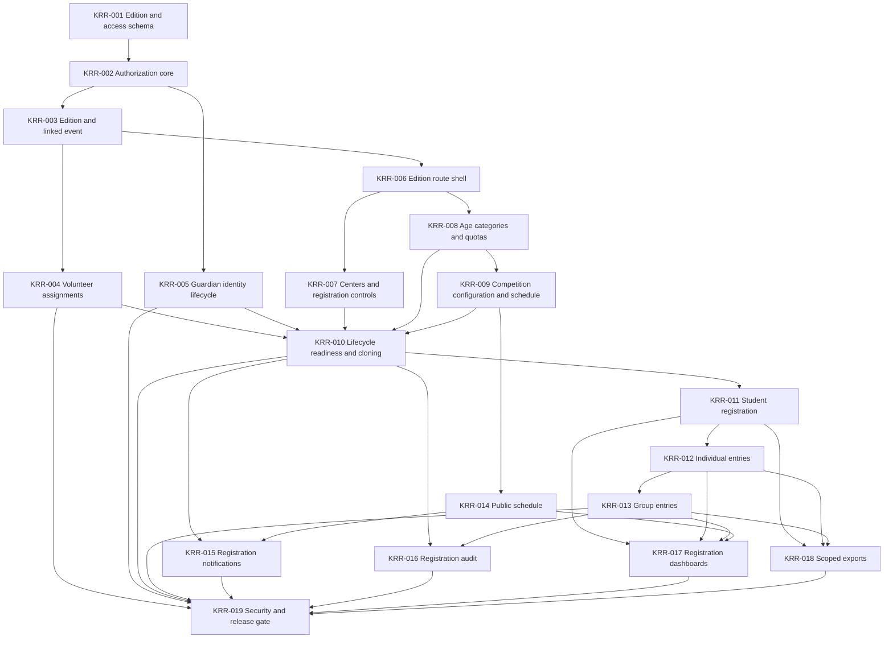

# Kalakriti Registration Release Task Breakdown

## Release outcome

The first release is complete when an administrator can create and configure a yearly Edition, assign central volunteers and external Guardians, open registration per Center, register Students and individual or group Competition Entries, expose the public schedule, and lock registration without enabling unfinished event-day features.

This breakdown implements Phase 0 and Phase 1 from [the architecture plan](./kalakriti-native-module-design.md). Task IDs are dependency identifiers for planning and assignment; they are not external tracker issue numbers.

## Scope guardrails

The release includes:

- the permanent Edition, access, authorization, registration, schedule, audit, export, and Credential foundations;
- lifecycle states through `registration_locked`;
- automatic yearly human IDs and Credential records, without printing;
- public schedule and registration-related notifications;
- focused unit, database, authorization, concurrency, route, and Playwright coverage.

The release excludes:

- offline operation queues and QR scanning;
- Student transport checkpoints, non-Student check-in, meals, and Competition attendance;
- buses, drivers, and event-day transport statuses;
- Scoresheets, submission photos, Results, points, and awards;
- inventory and archive workflows;
- old Kalakriti data migration or old-app changes.

## Dependency map



KRR-004, KRR-005, and KRR-006 can proceed in parallel after their dependencies. KRR-007 and KRR-008 can also proceed in parallel. Keep schema ownership with the task that introduces the behavior so later tasks do not create unused tables.

## Task conventions

Every implementation task must:

- use UUIDv7 IDs generated by the application;
- enforce Edition scope in authoritative commands and queries, not only in UI filters;
- add or update idempotent seed data for every new table;
- add focused tests through the domain command or public query interface;
- regenerate Drizzle migrations and Zero schema from source rather than editing generated files;
- update this plan when implementation evidence changes a dependency or invariant.

## KRR-001: Add the Edition and access schema spine

**Outcome:** The database can represent one yearly Edition, its persistent external identities, yearly login memberships, fixed responsibility assignments, and audit records without exposing business commands yet.

**Depends on:** None.

**Scope:**

- Add shared constants for lifecycle states, membership kinds, responsibilities, operational teams, assignment scopes, and the fixed `Asia/Kolkata` timezone.
- Add `kalakriti_edition` with unique year, unique linked event reference, lifecycle, event date, age cutoff date, planned registration close, branding key, and winner or runner-up point defaults.
- Add `kalakriti_external_identity`, `kalakriti_edition_membership`, `kalakriti_assignment`, and `kalakriti_audit_entry`.
- Use typed nullable scope foreign keys and check constraints for Responsibility Assignments instead of a polymorphic `scopeType/scopeId`.
- Add indexes for Edition lookup, active memberships, user access, responsibility checks, and audit pagination.
- Export schemas, add idempotent seeds, generate the migration, and regenerate Zero schema.

**Acceptance:**

- Duplicate Edition years and linked-event IDs are rejected.
- A user has at most one membership per Edition.
- Invalid responsibility and scope combinations fail at the database boundary.
- External identity records are not deleted when an Edition is deleted.

**Verify:**

```bash
bun run db:generate
bun run zero:generate
bun run check:types
bun run test:unit
```

## KRR-002: Build the Edition authorization core

**Outcome:** Server commands, Zero queries, routes, and UI can resolve the same Edition-scoped authority without creating a parallel role engine.

**Depends on:** KRR-001.

**Scope:**

- Add coarse `kalakriti.view` and `kalakriti.admin` permissions.
- Add the minimal technical `external_user` role with no central volunteer permissions.
- Implement helpers that resolve global-admin override, active Edition Membership, Responsibility Assignment, and scope ownership.
- Define explicit checks for Edition, Center, Competition Category, and Competition scopes.
- Add route-guard helpers that reject archived or inaccessible Editions before loading private data.
- Add adversarial tests for absent membership, archived membership, wrong Edition, wrong Center, wrong Competition, and global-admin override.

**Acceptance:**

- Possessing `kalakriti.view` alone never grants access to an Edition row.
- A valid assignment grants only its declared scope.
- Archived memberships fail closed.
- Global pi-dash administrators retain full override.

**Verify:**

```bash
bun run check:types
bun run test:unit
```

## KRR-003: Create Editions and protect linked events

**Outcome:** An administrator can create a draft Edition and its normal pi-dash event atomically, with the Edition remaining authoritative.

**Depends on:** KRR-001, KRR-002.

**Scope:**

- Implement `createEdition`, draft metadata updates, and current-Edition lookup.
- Require selection of an existing owning pi-dash Team.
- Create the linked `teamEvent` in the same database transaction and store its ID on the Edition.
- Synchronize Edition name and event date to the linked event.
- Reject direct linked-event core edits, cancellation, self-join, interest approval, attendance editing, and member management.
- Add database and command tests for rollback, duplicate year, linked-event protection, and source-of-truth synchronization.

**Acceptance:**

- A failed linked-event insert leaves no Edition.
- A failed Edition insert leaves no linked event.
- Direct event commands cannot drift protected fields or membership.
- Normal non-Kalakriti events retain existing behavior.

**Verify:**

```bash
bun run check:types
bun run test:unit
```

## KRR-004: Manage central volunteer memberships and responsibilities

**Outcome:** Edition administrators and Volunteer Coordinators can explicitly assign central users, and the linked event roster stays synchronized.

**Depends on:** KRR-002, KRR-003.

**Implementation sequencing:** Establish the fixed responsibility vocabulary,
membership lifecycle, primary-card label, and Edition-scoped Administrator,
Volunteer Coordinator, and Overall Events Lead workflows first. KRR-007 activates
the typed Center scopes for Liaisons and Transport Coordinators; KRR-009 activates
Competition Category and Competition scopes. Operational-team assignment UI lands
with the corresponding operational module, while using the same assignment table
and Volunteer Coordinator policy.

**Scope:**

- Implement Edition Administrator and Volunteer Coordinator appointment rules.
- Implement fixed Responsibility vocabulary, Edition-scoped create and remove,
  scope validation foundations, and primary card label.
- Restrict Volunteer Coordinator appointment to Edition or global administrators.
- Allow Volunteer Coordinators to assign the Overall Events Lead in this task.
  KRR-007, KRR-009, and the owning operational modules activate Center,
  Competition, Category, operational-team, and Liaison scopes.
- Enforce exactly one active Overall Events Lead.
- Insert or delete `teamEventMember` atomically when a central volunteer gains or loses the final qualifying assignment.
- Build assignment management UI with scoped pickers that exclude external identities.

**Acceptance:**

- Unassigned central volunteers cannot access the Edition.
- A user may hold multiple valid responsibilities.
- Removing one of several assignments does not remove the linked event member.
- Direct event-roster changes remain blocked.

**Verify:**

```bash
bun run check:types
bun run test:unit
```

## KRR-005: Implement the external Guardian identity lifecycle

**Outcome:** Administrators can invite yearly Guardians, reuse a dormant exact-email identity safely, and revoke access when its last membership ends.

**Depends on:** KRR-001, KRR-002.

**Scope:**

- Add dedicated Guardian invite and reactivation server functions using Better Auth.
- Create the `external_user` identity marker and yearly profile snapshot without using the normal volunteer-creation flow.
- Skip volunteer welcome, orientation WhatsApp, normal user directory, normal pickers, and normal dashboard landing behavior.
- Require administrator confirmation before reusing an exact verified dormant email.
- Preserve credentials on reuse and send an access notification without a new-password flow.
- On the final active membership ending, revoke sessions and block sign-in using Better Auth ban or an equivalent pre-session guard.
- Never globally disable a central user whose Edition membership ends.

**Acceptance:**

- Public Guardian signup does not exist.
- External identities are absent from every central user list and picker API.
- Similar names or phone numbers do not merge accounts.
- Dormant external identities cannot sign in and can be reactivated for a later Edition.

**Verify:**

```bash
bun run check:types
bun run test:unit
```

## KRR-006: Add the Edition route shell

**Outcome:** Authorized users enter a coherent Kalakriti section at canonical year-based routes without exposing unfinished modules.

**Depends on:** KRR-002, KRR-003.

**Scope:**

- Add private `/kalakriti/:year` routes and the Edition-level layout.
- Make `/kalakriti` redirect to the current accessible Edition.
- Redirect external Guardians to their accessible Edition after sign-in.
- Add lifecycle and scope information to the Edition context used by pages and actions.
- Add navigation gated by both coarse permission and Edition access.
- Hide Event-day, Results, Awards, and Inventory navigation in the Registration Release.
- Test route `beforeLoad` directly for global admins, assigned users, wrong year, archived membership, and no accessible Edition.

**Acceptance:**

- Direct URL access enforces the same checks as navigation.
- The year route resolves one Edition and never falls back to another Edition's data.
- Guardians do not land on or gain access to normal pi-dash administration pages.

**Verify:**

```bash
bun run check:types
bun run test:unit
```

## KRR-007: Manage Centers, yearly access, and registration controls

**Outcome:** Administrators can configure yearly Centers, assign Guardians and Liaisons, and control Student and Competition Entry registration independently per Center.

**Depends on:** KRR-004, KRR-005, KRR-006.

**Scope:**

- Add `kalakriti_center` and Center-assignment relations.
- Build Center create, edit, retire or protected-delete commands and UI.
- Let administrators assign Guardians; let Volunteer Coordinators assign Liaisons.
- Allow one Guardian or Liaison to cover multiple Centers.
- Add independent Student-editing and Competition-Entry registration flags.
- Add a bulk lock command that disables both flags for every Center.
- Require an explicit audited Center reopen; administrator commands cannot silently bypass a closed flag.

**Acceptance:**

- Guardians and Liaisons see only assigned Centers.
- Guardians cannot perform transport operations even though future Liaisons can.
- Closing one Center does not change another.
- A dependent Center cannot be deleted.

**Verify:**

```bash
bun run db:generate
bun run zero:generate
bun run check:types
bun run test:unit
```

## KRR-008: Configure Age Categories, limits, and Center quotas

**Outcome:** Administrators can define yearly eligibility rules that deterministically classify Students and constrain Center registration.

**Depends on:** KRR-002, KRR-006.

**Scope:**

- Add `kalakriti_age_category` and `kalakriti_center_age_quota`.
- Store inclusive age ranges, ordering, maximum total Competitions per Student, and maximum Competitions per Competition Category.
- Add per-Center, per-Age-Category male and female Student limits.
- Allow intentional gaps while rejecting overlapping age ranges.
- Implement a pure Age Category derivation function using the Edition cutoff date.
- Add administrative override metadata and mandatory reason support for later Student commands.
- Protect referenced Age Categories and quota parents from deletion.

**Acceptance:**

- Boundary dates classify deterministically in `Asia/Kolkata`.
- Overlapping ranges fail before registration can open.
- Gaps are allowed and produce a clear ineligible result.
- Quotas cannot reference a Center or Age Category from another Edition.

**Verify:**

```bash
bun run db:generate
bun run zero:generate
bun run check:types
bun run test:unit
```

## KRR-009: Configure Competitions, Venues, and Sessions

**Outcome:** The Overall Events Lead can prepare the one-day Competition catalog and schedule needed for registration.

**Depends on:** KRR-004, KRR-006, KRR-008.

**Scope:**

- Add Competition Category, Competition, Venue, and Competition Session schemas.
- Support individual or group participation, `male`, `female`, or `both` eligibility, group size rules, capacity, cancellation, and retirement.
- Restrict configuration and schedule edits to the Overall Events Lead or administrators.
- Keep Category Leads read-only for configuration.
- Require every Session to belong to one Age Category, fall on the Edition date, have valid start and end times, and use an active Venue.
- Reject same-Venue overlap and protect referenced configuration from deletion.
- Add schedule-change validation that can later check registered Student conflicts.

**Acceptance:**

- Exactly one active Overall Events Lead controls configuration.
- Invalid group rules and zero or negative capacities are rejected.
- A Venue cannot host overlapping Sessions.
- A Competition with registrations will be cancellable, not deletable.

**Verify:**

```bash
bun run db:generate
bun run zero:generate
bun run check:types
bun run test:unit
```

## KRR-010: Enforce lifecycle readiness, registration locks, and structural cloning

**Outcome:** Administrators can open and lock registration only when the Edition is valid, and structural configuration cannot drift after locking.

**Depends on:** KRR-003, KRR-004, KRR-005, KRR-007, KRR-008, KRR-009.

**Scope:**

- Implement readiness queries with explicit blocking reasons.
- Allow `draft -> registration_open -> registration_locked` and explicit `registration_locked -> registration_open`.
- Require confirmation for every transition.
- On entering `registration_locked`, make Student and Entry commands fail regardless of stale client state.
- Make Competition eligibility, capacity, Age Category, participation mode, and group rules immutable while locked.
- Allow safe schedule time and Venue changes only when no registered Student conflict results.
- Implement structural clone for Age Categories, limits, Competition Categories, Competition definitions, and Venues only.
- Do not clone Centers, Sessions, people, assignments, registrations, files, operations, Results, or inventory.

**Acceptance:**

- Registration cannot open with missing dates, Centers, valid Age Categories, quotas, Competition rules, Sessions, or Venues.
- Reopening does not silently reopen individual Center controls.
- Lifecycle and Center controls are both checked by registration commands.
- Structural clone produces no person or participation rows.

**Verify:**

```bash
bun run check:types
bun run test:unit
```

## KRR-011: Deliver Student registration

**Outcome:** A Guardian or Liaison can register and maintain Students for assigned Centers while all yearly eligibility and deletion rules remain authoritative.

**Depends on:** KRR-007, KRR-008, KRR-010.

**Scope:**

- Add `kalakriti_student` and `kalakriti_credential`.
- Generate the human-readable yearly ID and one active opaque Credential automatically on Student creation.
- Implement create, edit, and hard delete through the Registration command interface.
- Derive Age Category from DOB and support administrator override with a reason and audit entry.
- Enforce Center gender quotas transactionally.
- Warn on same-Center normalized name and DOB duplicates; require administrator confirmation for an exception.
- Block DOB or gender changes that invalidate Entries.
- Block deletion after any future operational, Result, or prize dependency exists; do not introduce withdrawn status.
- Build Center-scoped Student table and form UI.

**Acceptance:**

- A Guardian or Liaison cannot register outside assigned Centers.
- The relevant Center control and Edition state are checked on every write.
- Concurrent requests cannot exceed a quota.
- Student IDs remain stable when Credentials are later reissued.

**Verify:**

```bash
bun run db:generate
bun run zero:generate
bun run check:types
bun run test:unit
```

## KRR-012: Deliver individual Competition Entries

**Outcome:** Authorized Center users can register one Student in an eligible Competition Session with immediate validation and no approval queue.

**Depends on:** KRR-009, KRR-010, KRR-011.

**Scope:**

- Add `kalakriti_competition_entry` and `kalakriti_entry_member`.
- Implement individual entry create and remove commands.
- Enforce matching Edition, Center, Age Category, gender eligibility, active Session, capacity, per-Student total limit, per-category limit, and one Entry per Student per Session.
- Reject overlapping Sessions for the same Student with no administrator override.
- Enforce capacity transactionally under concurrent submissions.
- Make Entry deletion follow lifecycle and operational-dependency rules.
- Build the Center-scoped individual registration UI with actionable validation messages.

**Acceptance:**

- Valid Entries are active immediately.
- Full capacity blocks registration and creates no waitlist.
- A stale client cannot exceed capacity or bypass a lock.
- Cross-Edition and cross-Center Student references fail.

**Verify:**

```bash
bun run db:generate
bun run zero:generate
bun run check:types
bun run test:unit
```

## KRR-013: Deliver group Competition Entries

**Outcome:** Authorized Center users can register same-Center groups while preserving all individual Student limits and one-capacity-unit group semantics.

**Depends on:** KRR-012.

**Scope:**

- Add group Entry creation and membership-change commands on the existing Entry schema.
- Enforce Competition group mode, minimum and maximum size, same Center, unique Students, and one Student occurrence per Session.
- Apply gender, Age Category, count-limit, and schedule-conflict rules to every Entry Member.
- Count one group Entry as one Session capacity unit.
- Make group edits atomic so a failed member change leaves the prior group intact.
- Build group composition UI that explains member-specific rejection reasons.

**Acceptance:**

- Mixed-Center groups are rejected.
- A Student cannot appear in two Entries for the same Session.
- Concurrent group submissions cannot exceed capacity.
- Removing members below the minimum is rejected without corrupting the Entry.

**Verify:**

```bash
bun run check:types
bun run test:unit
```

## KRR-014: Publish the privacy-filtered schedule

**Outcome:** Attendees can view the current Edition schedule without authentication or exposure of private staffing and registration data.

**Depends on:** KRR-009, KRR-010.

**Scope:**

- Add a public allowlisted schedule query keyed by Edition year.
- Expose Competition, Age Category, start and end time, Venue, and cancellation state only.
- Add `/kalakriti/:year/schedule` outside the private app layout.
- Keep schedule data available after future archive.
- Update the projection immediately when an authorized schedule command commits.
- Add unauthenticated response tests that assert private fields are absent.

**Acceptance:**

- Student names, contact details, assignments, Judges, capacities, and internal notes never appear.
- Unknown or non-publicly-ready Editions return a safe not-found state.
- Schedule changes appear without a separate publish workflow.

**Verify:**

```bash
bun run check:types
bun run test:unit
```

## KRR-015: Send registration and schedule notifications

**Outcome:** Assigned Guardians and volunteers receive deterministic post-commit messages for registration and schedule changes.

**Depends on:** KRR-005, KRR-010, KRR-014.

**Scope:**

- Add notification topics and job payloads for registration open, 24-hour planned-close reminder, registration close, schedule change, and Guardian reactivation.
- Resolve recipients from active Edition Memberships and assignment scope.
- Use existing in-app and WhatsApp delivery; do not call delivery handlers directly from commands.
- Use deterministic idempotency keys derived from Edition, transition or schedule revision, recipient, and channel.
- Keep the planned-close reminder independent from the manual lifecycle transition.
- Add tests for recipient scope, retries, preference handling, and duplicate enqueue.

**Acceptance:**

- A Center-specific schedule impact notifies only affected Center users and assigned Competition staff.
- Retries do not create duplicate inbox records.
- Closing registration remains manual even after the reminder fires.

**Verify:**

```bash
bun run check:types
bun run test:unit
```

## KRR-016: Complete registration audit coverage

**Outcome:** Security-sensitive registration and configuration actions have a consistent, queryable audit trail.

**Depends on:** KRR-010, KRR-013.

**Scope:**

- Add administrator audit view and domain-scoped Lead audit view.
- Record Center reopen, lifecycle transition, Age Category override, schedule change, duplicate confirmation, cancellation, and administrator override actions.
- Standardize actor, Edition, domain, action, target, reason, timestamp, and structured before or after metadata.
- Require reasons where the architecture mandates them and reject blank normalized reasons.
- Add stable Edition and domain pagination.

**Acceptance:**

- Audit pagination is stable and includes actor, target, reason, and time.
- Leads see only their assigned domain and Edition administrators see the complete Edition log.
- Ordinary registration actions do not expose unrelated private profile fields in audit metadata.

**Verify:**

```bash
bun run check:types
bun run test:unit
```

## KRR-017: Add assignment-scoped registration dashboards

**Outcome:** Administrators and assigned users can monitor registration capacity and progress without loading or leaking the complete Edition dataset.

**Depends on:** KRR-011, KRR-012, KRR-013, KRR-014.

**Scope:**

- Add Edition, Center, Age Category, Competition Category, Competition, capacity, and quota aggregate queries.
- Build administrator, Center, Competition Category, and Competition dashboard projections.
- Filter every aggregate in the authoritative query according to Assignment scope.
- Keep public schedule aggregates separate from private registration totals.
- Add pagination or bounded result sets for all non-aggregate drill-downs.

**Acceptance:**

- Aggregate totals match authoritative rows after concurrent writes.
- A scoped user cannot infer another Center through totals, empty groups, or drill-down links.
- Dashboards render bounded read models instead of materializing every Student and Entry in the browser.

**Verify:**

```bash
bun run check:types
bun run test:unit
```

## KRR-018: Add assignment-scoped CSV exports

**Outcome:** Administrators and assigned users can export registration data without gaining broader read access.

**Depends on:** KRR-011, KRR-012, KRR-013.

**Scope:**

- Add full Edition Student and Competition Entry exports for Edition and global administrators.
- Add Center-scoped exports for Guardians and Liaisons.
- Add Competition Category and Competition-scoped exports for assigned Leads and Coordinators.
- Resolve authorization and rows on the server before streaming CSV.
- Use allowlisted columns and exclude credentials, audit metadata, hidden contacts, and data outside the actor's assignment.
- Keep CSV import unavailable.

**Acceptance:**

- Exported rows and aggregate counts match the actor's dashboard scope.
- Directly changing an Edition, Center, Category, or Competition ID cannot broaden the export.
- CSV formula injection is neutralized for user-entered text.

**Verify:**

```bash
bun run check:types
bun run test:unit
```

## KRR-019: Pass the Registration Release security and quality gate

**Outcome:** The release is safe to expose in production and unfinished later phases remain inaccessible.

**Depends on:** KRR-004, KRR-005, KRR-010, KRR-013, KRR-015, KRR-016, KRR-017, KRR-018.

**Scope:**

- Add Playwright fixtures and idempotent seed data for global admin, Edition admin, Volunteer Coordinator, Overall Events Lead, Category Lead, Guardian, Liaison, unrelated volunteer, and dormant external user.
- Add E2E flows for Edition creation, linked event, assignments, Guardian invite and reuse, Center controls, Student registration, individual Entry, group Entry, public schedule, bulk lock, reopen, and registration lock.
- Add direct URL and direct API authorization tests.
- Add database concurrency tests for quotas, Session capacity, one-live invariant preparation, and duplicate membership or Entry races.
- Run privacy checks against public schedule and scoped exports.
- Verify no route, navigation item, mutation, or query exposes Event-day, Results, Awards, or Inventory behavior.
- Update README, project structure, and the relevant architecture chapters for the implemented subsystem boundaries.

**Acceptance:**

- Every release acceptance criterion in the architecture plan has automated evidence or a documented manual check.
- Cross-Edition, cross-Center, and out-of-scope requests fail closed.
- A dormant Guardian cannot obtain a session.
- The branch has no unexplained diffs or generated-file edits.

**Verify:**

```bash
bun run check:types
bun run test:unit
bun run check
bun run check:unused
bun run test:e2e
```

## Suggested delivery waves

1. **Access foundation:** KRR-001 through KRR-006 establish the permanent Edition, identity, authorization, linked-event, and route boundaries.
2. **Configuration:** KRR-007 through KRR-010 deliver the Center, eligibility, Competition, schedule, and lifecycle setup needed to open registration.
3. **Registration:** KRR-011 through KRR-013 deliver Students and individual or group Entries with transactional limits.
4. **Release surfaces:** KRR-014 through KRR-018 deliver public schedule, notifications, audit, dashboards, and exports.
5. **Production gate:** KRR-019 proves authorization, concurrency, privacy, and the complete registration journey.

Do not begin Event-day implementation until KRR-019 passes. Later phases depend on the identity, Credential, lifecycle, and immutable command boundaries established here.
